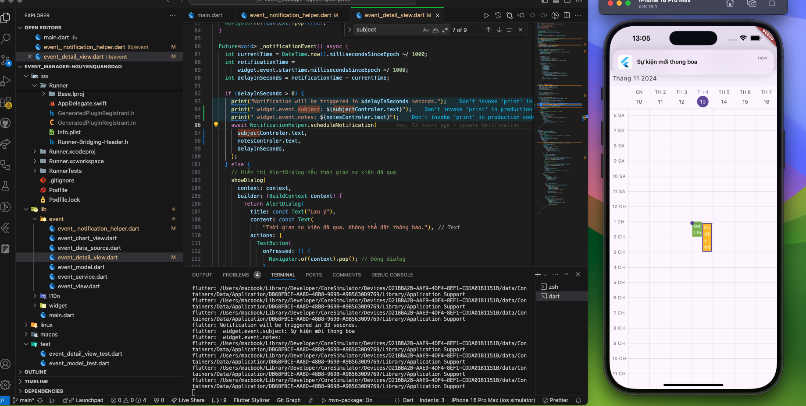

[](https://classroom.github.com/a/9O4F1fO8)
[](https://classroom.github.com/online_ide?assignment_repo_id=16950867&assignment_repo_type=AssignmentRepo)

# Bài kiểm tra giữa kỳ - Bài 1

- **Môn học:** Phát triển ứng dụng di động đa nền tảng 1
- **Giảng viên:** GVC.TS. Trần Trung Chuyên
- **Sinh viên:** Nguyễn Quang Đạo
- **Mã sinh viên:** 2121050451
- **Lớp:** DCCTCT66_05D
- **Đề tài:** Xây dựng và kiểm thử ứng dụng Quản lý sự kiện

# Demo bài làm: [Nhấn vào đây để xem video demo](./imagevideo_demo/demoAppEvent.mp4)



## cấu trúc thư mục


## event_notification_helper.dart


## event_model.dart

 

## event_data_source.dart


## event_service.dart


## event_view.dart

  

## event_detail_view.dart

  

## event_chart_view.dart


# Hướng dẫn:

Chào mừng bạn đến với dự án Quản lý sự kiện! Tệp README này sẽ hướng dẫn bạn hoàn thành bài tập.

## Cấu trúc Dự án

Dưới đây là tổng quan về cấu trúc dự án:

```
/.github/workflows/
  flutter_test.yml
/test/
  event_model_test.dart
  event_service_test.dart
  event_view_test.dart
  main_test.dart
  event_detail_view_test.dart
/lib/
  main.dart
```

## Bắt đầu

### Yêu cầu

Đảm bảo rằng bạn đã cài đặt Flutter phiên bản 3.24.3 trở lên trên máy của mình. Bạn có thể làm theo hướng dẫn [tại đây](https://flutter.dev/docs/get-started/install) để cài đặt Flutter.

### Thiết lập Dự án

1. **Clone repository:**

Sau khi nhận bài tập từ Github Classroom, hãy sử dụng Visual Studio Code > View > Command Palette > Git: Clone để clone repository về máy của bạn. Hoặc sử dụng dòng lệnh sau:

```sh
git clone <repository-url>
```

Trong đó `<repository-url>` là URL của repository bạn vừa nhận được.

2. **Cài đặt các phụ thuộc:**

Sau khi clone repository, mở thư mục dự án trong Visual Studio Code và chạy lệnh sau để cài đặt các phụ thuộc:

```sh
flutter pub get
```

Phát triển ứng dụng của bạn bắt đầu bằng cách xem clip hướng dẫn sau:

<iframe width="560" height="315" src="https://www.youtube.com/embed/_qlCQVKW2jQ?si=tHhBuqRnOGaWR7xB" title="YouTube video player" frameborder="0" allow="accelerometer; autoplay; clipboard-write; encrypted-media; gyroscope; picture-in-picture; web-share" referrerpolicy="strict-origin-when-cross-origin" allowfullscreen></iframe>

### Chạy kiểm thử

Dự án bao gồm một số tệp kiểm thử nằm trong thư mục `test`. Các kiểm thử này sẽ tự động chạy bằng GitHub Actions như được định nghĩa trong tệp `.github/workflows/flutter_test.yml`.

Để chạy kiểm thử trên máy cục bộ, sử dụng lệnh sau:

```sh
flutter test
```

### Các tệp kiểm thử

- **main_test.dart:** Kiểm thử khởi động ứng dụng chính.
- **event_model_test.dart:** Kiểm thử lớp `EventModel`.
- **event_service_test.dart:** Kiểm thử lớp `EventService`.
- **event_view_test.dart:** Kiểm thử widget `EventView`.
- **event_detail_view_test.dart:** Kiểm thử widget
  `EventDetailView`.

### Hoàn thành bài tập

1. **Xem lại các kiểm thử đã cung cấp:** Hiểu rõ mỗi kiểm thử đang kiểm tra điều gì.
2. **Triển khai chức năng cần thiết:** Viết mã cần thiết trong thư mục `lib` để đảm bảo tất cả các kiểm thử đều thành công.
3. **Chạy kiểm thử:** Đảm bảo tất cả các kiểm thử đều thành công bằng cách chạy `flutter test`.

### Nộp Bài tập

Khi bạn đã hoàn thành bài tập và tất cả các kiểm thử đều thành công, hãy commit và push mã nguồn của mình lên Github. Bạn có thể kiểm tra kết quả kiểm thử trên tab Actions của repository. Nếu Status là Success, nghĩa la bạn đã hoàn thành bài tập.

Chúc bạn may mắn với bài tập!

---

revised
